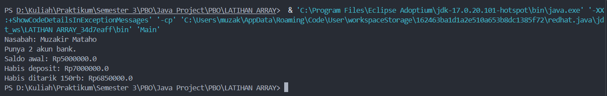

# PBO-Array-dan-ArrayList
# 🏦 PBO 4 — Array & ArrayList

**Pemrograman Berorientasi Objek | Java**

Repository ini berisi latihan PBO 4 mengenai pengelolaan rekening dan data nasabah menggunakan Java. Program menerapkan konsep class, object, constructor, encapsulation, method, dan array.

---

## 📌 Deskripsi Program

Program simulasi rekening bank sederhana yang dapat menyimpan informasi nasabah, mengelola rekening, serta melakukan transaksi dasar seperti menambah dan mengurangi saldo.

Program dibuat menggunakan beberapa class yang saling berhubungan untuk memahami penerapan konsep Object-Oriented Programming (OOP) dalam Java.

## 🎯 Tujuan Pembelajaran

- Memahami penggunaan class dan object.
- Memahami constructor untuk menginisialisasi object.
- Menerapkan encapsulation menggunakan atribut `private`.
- Menggunakan array untuk menyimpan beberapa object.
- Memahami penggunaan method untuk mengakses dan mengubah data.
- Memahami hubungan antara class `Bank`, `Customer`, dan `Account`.

## 📂 Struktur File

| File | Fungsi |
|---|---|
| `Account.java` | Mengelola saldo dan transaksi rekening. |
| `Customer.java` | Menyimpan data nasabah dan daftar rekening. |
| `Bank.java` | Menyimpan dan mengelola data nasabah. |
| `Main.java` | Menjalankan program dan menampilkan hasil transaksi. |

## ⚙️ Fitur Program

- Menyimpan nama nasabah.
- Menyimpan beberapa rekening dalam array.
- Menampilkan jumlah rekening yang dimiliki nasabah.
- Menampilkan saldo awal rekening.
- Melakukan deposit atau penambahan saldo.
- Melakukan withdrawal atau penarikan saldo.
- Menampilkan saldo setelah transaksi.

## 💻 Konsep OOP yang Digunakan

### 1. Class dan Object

Class digunakan sebagai cetakan untuk membuat object. Contohnya, class `Account` digunakan untuk membuat rekening dengan saldo tertentu, sedangkan class `Customer` digunakan untuk membuat data nasabah.

### 2. Encapsulation

Encapsulation diterapkan dengan menggunakan atribut `private`, seperti `balance`, `firstName`, dan `lastName`. Data tersebut diakses melalui method yang tersedia.

### 3. Constructor

Constructor digunakan untuk memberikan nilai awal ketika object dibuat.

Contoh:

`Account akun1 = new Account(5000000);`

Kode tersebut membuat object rekening dengan saldo awal Rp5.000.000.

### 4. Array

Array digunakan untuk menyimpan beberapa object dengan tipe data yang sama.

Contohnya, `Account[]` pada class `Customer` digunakan untuk menyimpan beberapa rekening, sedangkan `Customer[]` pada class `Bank` digunakan untuk menyimpan beberapa nasabah.

### 5. Method

Method digunakan untuk menjalankan operasi tertentu.

- `getBalance()` — mendapatkan saldo rekening.
- `deposit()` — menambahkan saldo.
- `withdraw()` — mengurangi saldo.
- `setAccount()` — menambahkan rekening ke nasabah.
- `addCustomer()` — menambahkan nasabah ke bank.

## ▶️ Cara Menjalankan Program

**Persyaratan:** Java JDK sudah terpasang dan dapat digunakan melalui terminal.

1. Buka folder project di Visual Studio Code.
2. Pastikan keempat file Java berada dalam folder yang sama.
3. Buka terminal.
4. Compile semua file dengan perintah berikut:

   ```bash
   javac Account.java Customer.java Bank.java Main.java
   ```

5. Jalankan program:

   ```bash
   java Main
   ```

## 📊 Contoh Output Program

```text
Nasabah: Muzakir Mataho
Punya 2 akun bank.
Saldo awal: Rp5000000.0
Habis deposit: Rp7000000.0
Habis ditarik 150rb: Rp6850000.0
```

*Catatan: Nama nasabah mengikuti nilai yang dimasukkan pada `Main.java`.*

## 📸 Screenshot Hasil Program

Screenshot berikut menunjukkan hasil eksekusi program melalui terminal.



